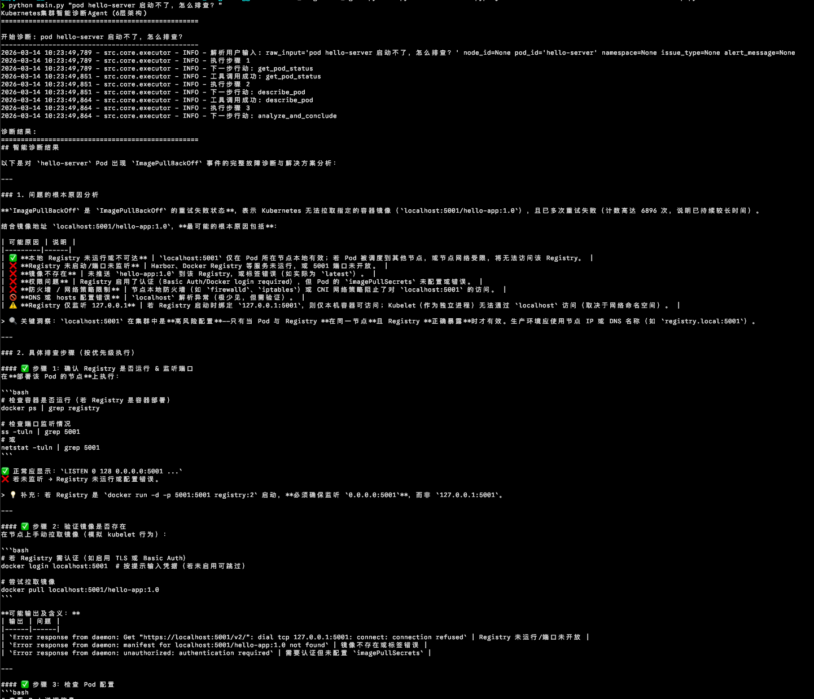

# Kubernetes AI智能诊断Agent (6层架构)

这是一个基于大模型(LLM)驱动的Kubernetes集群智能诊断AI Agent，能够理解自然语言输入并自动执行针对性的故障排查。通过集成多种大模型提供商（Anthropic、OpenAI、Qwen等），提供智能化的诊断分析和解决方案建议。

## 6层架构设计

### 1️⃣ 用户交互层
- 接收自然语言输入（如"节点abc报警了，怎么排查？"）
- 解析用户意图，提取节点ID、Pod ID、问题类型等关键信息
- 转换为系统内部状态对象

### 2️⃣ 状态管理层  
- 使用Pydantic模型定义诊断状态
- 记录每个排查步骤的执行结果
- 管理工具调用历史和完成条件

### 3️⃣ 工具调用层
- 封装kubectl命令为可复用函数
- 支持的工具：
  - `get_node_status`: 获取节点整体状态
  - `describe_node`: 获取节点详细配置和事件日志  
  - `get_pod_status`: 获取Pod运行状态
  - `get_pod_logs`: 收集特定Pod日志
  - `top_nodes/pods`: 查看资源使用情况（需metrics-server）

### 4️⃣ 条件路由层
- 根据已收集信息动态判断下一步行动
- 智能分支逻辑：
  - 检测到OOM错误 → 优先查看日志
  - 检测到磁盘压力 → 检查节点详细信息
  - 节点NotReady → 获取节点事件日志

### 5️⃣ 分析决策层 (大模型驱动)
- 集成大模型(LLM)进行智能分析和诊断
- 使用大模型分析Kubernetes事件、日志和配置
- 生成专业的诊断报告和解决方案建议
- 支持Anthropic、OpenAI、Qwen等多种大模型提供商
- 提供规则引擎回退机制确保可靠性

### 6️⃣ 执行控制层
- 管理整个排查流程的执行顺序
- 支持多轮循环直到完成或达到最大步骤数
- 处理异常和错误状态

## 安装使用

```bash
# 安装依赖
pip install -e .

# 复制配置文件
cp .env.example .env

# 配置大模型（可选但推荐）
# 编辑 .env 文件，设置 LLM_PROVIDER、LLM_API_URL、LLM_API_KEY 等参数
# 支持的提供商：anthropic, openai, google, azure, deepseek, minimax, qwen

# 使用示例
python main.py "节点worker-01内存压力大，怎么排查？"
python main.py "pod my-app-7d8f9c8b7-xyz频繁重启"
python main.py "检查default命名空间中所有Pod的状态"
```

## 功能特性

- **大模型智能分析**: 集成LLM进行深度诊断分析，支持多种模型提供商
- **AI Agent架构**: 基于6层架构的自主决策AI Agent
- **自然语言理解**: 支持中文和英文输入
- **智能路由**: 根据问题类型自动选择最优排查路径  
- **全面诊断**: 覆盖节点、Pod、网络、存储等多个维度
- **详细报告**: 生成包含问题发现和解决方案的完整报告
- **灵活扩展**: 模块化设计，易于添加新的诊断工具和规则

## 示例截图



## 大模型集成

本AI Agent支持多种大模型提供商，通过统一的配置接口进行集成：

### 支持的模型提供商
- **Anthropic**: Claude系列模型
- **OpenAI**: GPT系列模型  
- **Google**: Gemini系列模型
- **Azure**: Azure OpenAI服务
- **DeepSeek**: DeepSeek-Coder系列
- **MiniMax**: abab系列模型
- **Qwen**: 通义千问系列模型

### 配置参数
- `LLM_PROVIDER`: 模型提供商 (默认: anthropic)
- `LLM_API_URL`: API端点URL (可选，会根据提供商自动设置)
- `LLM_API_KEY`: API密钥
- `LLM_API_FORMAT`: API格式 (anthropic 或 openai)
- `LLM_MODEL`: 具体模型名称
- `LLM_TEMPERATURE`: 生成温度 (默认: 0.7)
- `LLM_MAX_TOKENS`: 最大输出token数 (默认: 4096)

### 智能分析功能
- **事件分析**: 自动分析Kubernetes事件并提供根本原因
- **日志分析**: 解析Pod日志识别错误模式
- **综合报告**: 生成包含问题发现、解决方案和预防措施的专业报告
- **规则回退**: 当大模型不可用时，自动切换到规则引擎确保基本功能

## 权限要求

确保当前用户有以下Kubernetes权限：
- `nodes` 资源的 `get`, `list` 权限
- `pods` 资源的 `get`, `list` 权限（所有命名空间）
- `events` 资源的 `list` 权限（所有命名空间）
- `namespaces` 资源的 `list` 权限

## 故障排除

如果遇到连接问题，请确保：
1. `kubectl` 配置正确且能正常访问集群
2. 当前用户有足够的RBAC权限  
3. 集群API服务器可访问